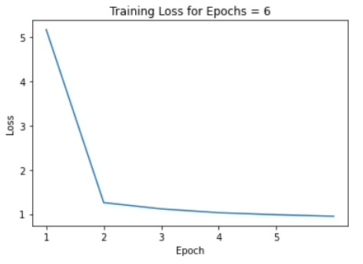

# Lyrics Generator 🎶

## Table of Contents

- [Introduction](#introduction)
- [Model](#model)
- [Data](#data)
- [Training](#training)
- [Results](#results)
- [Ethical Considerations](#ethical-considerations)
- [Authors](#authors)

## Introduction

The goal of this project is to create a model that generates 80's and 90's love song lyrics. This is an unsupervised learning problem that deals with sequential data, since songs are usually contextual. For this reason, we'll be doing it using **(1)** a recurrent neural network (RNN) with gated recurrent units (GRU) and **(2)** using the [OpenAI GPT-2 transformer model](https://huggingface.co/gpt2) provided by Huggingface and fine-tuning it.

Users will input the model, maximum length of the output lyric sequence and a temperature to generate lyrics using method **(1)**. To produce lyrics using method **(2)**, users will input a top_p, top_k, the number of returned lyric sequences and a maximum length for each lyric sequence.

## Model

**Method (1):**

This model has three layers, namely the embedding layer, the GRU layer, and the linear layer. Each layer has a certain number of parameters.

The embedding layer has a 256✕256 weights matrix. Each row in this matrix represents a character. The desired row is isolated when multiplied by the one-hot input vector. Thus, there are 22,016 parameters in this layer, which is the total number of weights in the weight matrix.

The PyTorch implementation of the GRU layer has the following functions:

The parameters in this layer are the weights and biases applied to the input character at time t, x_t, and the character predicted by the hidden state at time t-1 or at the initial time of 0, h_(t-1), to calculate the reset, update, and new gates. 

The weights applied to x_t, W_i, have the shape 256✕256. There are three such matrices, specifically W_ir, W_iz, and W_in, one for each gate. Therefore, the total number of weights are 256✕256✕3, i.e. 22,016. The biases added to the product of the weights and the input character are vectors of size 256✕1 and, since there are three such biases, there is a total of 768 biases applied to this product.

A similar calculation is done using h_(t-1). The weights applied to h_(t-1), W_h, have the shape 256✕256. There are three such matrices, specifically W_hr, W_hz, and W_hn, one for each gate, which results in a total of 256✕256✕3, i.e. 22,016, weights. The biases added to the product of the weights and h_(t-1) are vectors of size 256✕1, resulting in a total of 768 biases across the calculations for all three gates.

In the final linear layer,a weight matrix and a bias vector is applied to the tensor generated by the GRU to predict the character at time t. The weight matrix has a shape of 86✕256, where 256 is the shape of the tensor that represents a character and there are 86 characters to be predicted, and the bias has a shape of 86✕1. Therefore, there is a total of 22,016 weights and 86 biases.

Based on the discussion above, there is a total of 438,870 parameters in this model.

The following is a successful lyrics that was generated by this model. 62.5% of our survey audience assumed that it was written by a person.

I love you so
And I know if you can have a piece of my love
(You can't keep runnin')
You're my everything (You're my love)
You are all I need a tear
It would be alright
(Ooh, oh, oh, oh, oh, oh, oh, oh, oh, oh)
You around
You bring me joy
When the painto and love you, baby
You are my everything
You are my lady
(Saranted me to me)
You can have a piece of my love
You are that you are here are here
(When love zone)
You are
You are my everything
(Your love is king)
Never and let me love you love me

The following is a unsuccessful lyrics that was generated by this model. Only 6.3% of our survey audience assumed that it was written by a person while 93.8% correctly predicted that this was generated by our model.

I feel the love that's true
Tell me tomorrow, it's so amazing?
You see
You are my larm
All I want you
You got to want to hold you hear me
And what I'll all about it
Love so good love will be alone
And then you love me what more can I say
Just about you
Baby, I'll be alright

The training curve of this model is as follows:

The hyper-parameters that we tuned are the batch size, the learning rate, and the temperature. 

We began by fixing the learning rate at 0.001, a value that gave us a reasonable performance, and then adjusting the batch size as needed. A large batch size caused the training curve to take a long time to converge. A batch size of 10 and below resulted in a smaller level of loss. Since the difference between the training curves of different batch sizes of sizes 10 and below were negligible, we chose to set our batch size to 10.

We then tested various values for the learning rate. We concluded that a learning rate of 0.007 resulted in the best performance. Higher learning rates resulted in a volatile loss function, and lower learning rates caused the loss function to take an extremely long time to converge. 

Finally, when generating the songs, we settled on a temperature of 0.5. Higher temperatures resulted in more grammatical errors, spelling errors, and produced words that were not real. Lower temperatures resulted in songs with repeated words and sentences or sentences that were not comprehensible.

**Method (2):** GPT-2 is a generative model that is capable of writing novels, news articles and even poetry. In order for GPT-2 to generate song lyrics, it needs to be fine-tuned using lyrical data.

## Data

### Data Source

Our data is a collection of 80’s and 90’s love song lyrics scraped from Genius.com. To find songs to use, we curated a collection of playlists from Spotify and used each song we found (disregarding duplicates among playlists). To acquire the lyrics, we used the artist and song name of each track to scrape the lyrics off of Genius.com. In total, we had lyrics for 184 songs in our dataset.

### Data Summary

In order to interpret our results, we collected a number of summary statistics on our data. We found that, on average, a song in our dataset was 1559.25 characters long, and 323.69 words long. As such, the inputs to our model are fairly long. 

We also investigated the amount of repetition that exists in our dataset. Our data had 80 unique characters and 3805 unique words. As for the frequencies of these words, we found that the top 20% of our most frequently used words made up for 87.27% of the words used in our lyrics. We also found that the top 10 words used in our songs were as follows:

| Word      | Frequency (%) |
| ----------| ----------- |
| I         | 5.36       |
| you       | 4.97        |
| the       | 2.58       |
| to        | 2.33        |
| me        | 1.77       |
| my        | 1.49        |
| love      | 1.23       |
| And       | 1.14        |
| a         | 1.05       |
| in        | 1.02        |

As for the length of each lyric, each line of our songs are, on average, 29.05 characters in length and 6.23 words long.

### Data Augmentation

**Method (1):** Our dataset was quite small, with only 184 songs. As such, we decided that we would attempt to augment our data in order to compensate for our lack of examples. To do this, we used the nlpaug library. 

We decided to only perform data augmentation on the GRU model. We were unsure of how data augmentation would affect the performance of our model, because while it would provide us with more data, the new data did seem to be quite different from our original lyrics. As such, we thought that our models may end up performing worse than had we used the original data. Since the GRU model was completed before the GPT-2 model, we decided to experiment with the augmented data on the GRU model instead.

We augmented at the character and word level. When it came to character level augmentation, we randomly swapped adjacent characters, inserted new characters, and deleted characters from our lyrics. As for word level augmentation, we randomly swapped and deleted words, as well as randomly split words into two words. Each of these techniques were performed on the entire dataset, and thus, our final dataset consisted of 1104 songs.

### Data Transformation

**Method (1):** Our dataset was stored in a csv file, where the songs were stored in the first column, and each cell in the column contained one song. To tokensize our data, we created a torchtext.legacy.Field object for sequential data, using “<BOS>” and “<EOS>” as the beginning and end of string tokens. We used this field to create a torchtext.legacy.TabularDataset object to store the dataset from the csv file. Then, our field object used our tabular dataset object as an input to build our vocabulary.
  
```python
text_field = torchtext_data.Field(sequential=True,      # text sequence
                                  tokenize=lambda x: x, # because are building a character-RNN
                                  include_lengths=True, # to track the length of sequences, for batching
                                  batch_first=True,
                                  use_vocab=True,       # to turn each character into an integer index
                                  init_token="<BOS>",   # BOS token
                                  eos_token="<EOS>")    # EOS token

fields = [('text', text_field)]
lyrics = torchtext_data.TabularDataset("/content/drive/MyDrive/csv_lyrics", "csv", fields)
text_field.build_vocab(lyrics)
vocab_stoi = text_field.vocab.stoi
vocab_itos = text_field.vocab.itos
vocab_size = len(text_field.vocab.itos)
```

**Method (2):** Input strings need to be tokenized (converted into a numerical representation) before they are passed to the model for training or generation. The transformers library comes with a word-based tokenizer, which we used for this project.

```python
# Load GPT2 tokenizer

tokenizer = GPT2Tokenizer.from_pretrained('gpt2', bos_token='<|startoftext|>', eos_token='<|endoftext|>', pad_token='<|pad|>')

# Necessary if we have added our own custom tokens

model.resize_token_embeddings(len(tokenizer))
```

An example of the tokenizer in use:

```python
test_sentence1 = "I love this computer science class"
input_ids1 = tokenizer.encode(test_sentence1, return_tensors='pt')

test_sentence2 = "I love puppies"
input_ids2 = tokenizer.encode(test_sentence2, return_tensors='pt')

print(input_ids1) # tensor([[  40, 1842,  428, 3644, 3783, 1398]])
print(input_ids2) # tensor([[   40,  1842, 37793]])
```

### Data Split

For both methods **(1)** and **(2)**, the dataset was not split - the entire dataset was used to train with. In this problem, we're trying to understand the underlying structure of the data instead of performing a classification task where there is a right and wrong answer. Usually, we're able to calculate accuracy for a test set to determine whether the model is good or bad, but measurements like accuracy are not applicable for a creative task. For this reason, we didn't split our data before training.

## Training

**Method (2):**



| Epoch | Training Loss |
| ----- | :-----------: |
| 1     |   5.159400    |
| 2     |   1.258556    |
| 3     |   1.117548    |
| 4     |   1.031602    |
| 5     |   0.985897    |
| 6     |   0.951483    |

When training the GPT-2 model, we found that using epochs equal to 5 and 6 yielded a similar training loss by the last epoch. Each time, the largest decrease in training loss happened between epochs 1 and 2. Epochs beyond 2 decreased minimally relative to this and each epoch took approximately 25 minutes to train, so epochs greater than 6 were not tested. We used a batch size of 2 because anything larger than 2 resulted in an out of memory error. We could have used accumulated gradients in order to use larger batch sizes, but did not for this project. When trying a learning rate of 0.0001, the lyrics were very repetitive and random-sounding compared to a learning rate of 0.0005. This smaller learning rate could have prevented the model from converging, since the number of epochs were kept the same in both training sessions and 0.0005 produced significantly better lyrics. We used a learning rate scheduler during training and the number of warmup steps was set to 100. The scheduler decreases the learning rate as the number of epochs increases. This prevents the optimization of the loss function from diverging. We chose a small epsilon value because we wanted the model to choose the next word with the highest probability most of the time.

## Results

### The Survey

To measure the success of our model, we conducted a single-blind survey to determine whether the songs generated by our model could be distinguished from real songs. Participants were given 12 examples of song lyrics, where four songs were generated by the GRU model, four songs were generated by the GPT-2 model, and four songs were real. For each example, participants were asked to label the lyrics as Real or Fake, as well as explain the reasoning behind their answer. In total, we had 16 people take the survey.

To measure the success of each model, we used the average percentage of “Real” responses among the examples from the model. The formula was: `“Real” responses / (# participants * # songs from model) * 100%`

We found that the GRU model had an average of 26.78% “Real” responses, the GPT-2 model had an average of 42.63% “Real” responses, and interestingly, the real songs had an average of 90.65% “Real” responses. As such, the GPT-2 model seems to perform significantly better than the GRU model, and gets distinguished as a real song approximately half as frequently as real songs are.

The feedback provided in the survey was highly informative, allowing us to understand what made songs seem either real or fake. When determining that a song is real, one common response among participants was that the song lyrics rhymed—many seemed doubtful that a model could have generated rhyming schemes. Another common response was that the song was cohesive, and stayed true to a consistent topic throughout each line. On the other hand, when deciding that a song was fake, many participants responded that there were grammatical mistakes in the lyrics or that some words were nonsensical. Participants also often said that the lines in a song did not relate to each other, and that there wasn’t a clear topic that guided the piece.

### The GRU Model

To understand why the GRU model did not perform well, we considered the feedback responses that we received when it did not produce convincing songs and attempted to determine what could have caused these to occur.

The most common critique of our model was that it produced grammatically incorrect lyrics, and that some words it generated were nonsensical. It seems that our model was not trained well enough to be able to predict the next characters in a way that formed sensible words and . We hypothesize that this is because of a lack of data. If we had used more data, the model may have been exposed to more words and been able to predict characters more correctly. 

We hypothesize that this is because of a lack of data. The reason nonsensical words were generated is likely due to the fact that the model was not exposed to enough words in order to predict characters that would create a sensible word when taking into consideration the last few characters that were predicted. In addition, if the model was trained on more data, it may have been able to gain a better understanding of English grammar, and would have generated lyrics that were coherent.

While we did try to augment our data to fix this issue, the training loss of our model with the augmented dataset was higher than our model trained on the original dataset, and after examining the lyrics generated by each, it was clear that the original dataset resulted in better lyrics. The augmented dataset lead to lyrics with significantly more nonsensical words, as well as lyrics that did not make grammatical sense. We suspect that the character level augmentation resulted in more nonsensical words, as we introduced nonsensical words into the dataset by swapping, deleting, and substituting characters. Similarly, we suspect that the word level augmentation may have diminished the model’s ability to follow grammatical rules, as we introduced grammatically incorrect lyrics into the data by swapping and deleting words.


## Ethical Considerations

Using this model to compose lyrics that which are publicly shared can lead to issues involving ownership and copyright. Musicians and record labels who write or record the original song usually own the copyright for it. Co-writers of a song will be joint copyright holders for it with equal rights, however, musicians can negotiate to for unequal rights. With a song co-written by this model, it becomes complicated whether credit should be given to the model, the engineers that designed the model, or the user who gave the prompt to the model.

Copyright is a serious issue that can leave a guilty party liable for payment. It's possible for this model to produce the same lyrics for multiple users and this becomes risky if the user is submitting the song to a competition or for assignment. The overlap in similarity in these cases is easily detectable if used in public. The model can also produce lyrics that already exist. Although some songs contain identical/similar phrases without issue, this can appear unoriginal and can be problematic in the case of a competition.

Copyright issues can extend to using existing songs to train the model. Being that this assignment is for educational purposes, we can use the lyrics without the risk of copyright infringement. However, this becomes a risk if the songs being created are released publicly and are being monetized. Copyright is concerned with the point of when a song is copied and in machine learning, the point would be gathering the training data.

Copyright is meant to protect a person's musical works. Copyright infringement is particularly harmful to the person found guilty. The guilty party may be ordered to pay fines/damages and can also suffer reputational damage as well. This is especially concerning because we are using Genius lyrics to train this model and potentially leaving ourselves vulnerable to copyright infringement if this model is used to produce a song for more than a momentary laugh. People who produce lyrics similar to a song that already exists can also be at risk for copyright infringement. Users of this model should be careful not to use the same instrumentals as existing songs.

Depending on the age of the user or the intended audience of a song produced by this model, some undesirable lyrics consisting of profanity/racism/etc. may be produced (e.g. I'd kill my mom for love). This can be seen as inappropriate to some and in the future, a way to filter out inappropriate lyrics would be a good feature.

## Authors and Credit

[Nameera Azim](https://github.com/NameeraAzim)

- GRU model training and overfitting

[Yousef Bulbulia](https://github.com/CometWhoosh)

- Data scraping and augmentation

[Kimberly Cao](https://github.com/kimberlycao)

- GPT-2 model fine-tuning
